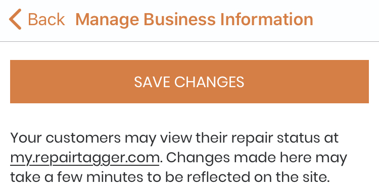

.. _bizinformation:

####################
Business Information
####################

Your business information is shown on your public repair status page.
(See: :ref:`repairstatuspage` for more details.)
You can find the link to your shop's page at the top of this screen.

To change your businesses name, address, or phone number, tap in the field,
update the information, and tap on 'Save Changes'.

To add a logo photo, tap on the image icon and take a picture of your logo.

To change the existing photo, tap on it, take a new logo photo, and then tap on
'Save Changes'.
