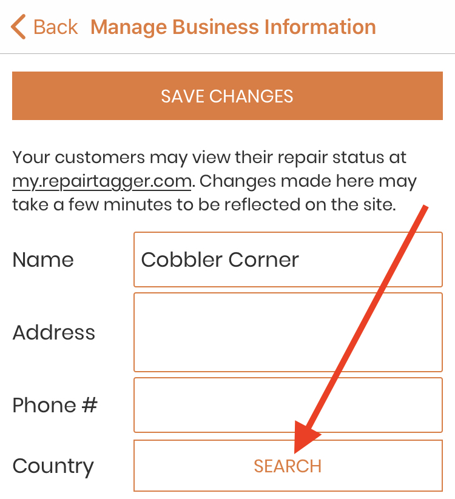
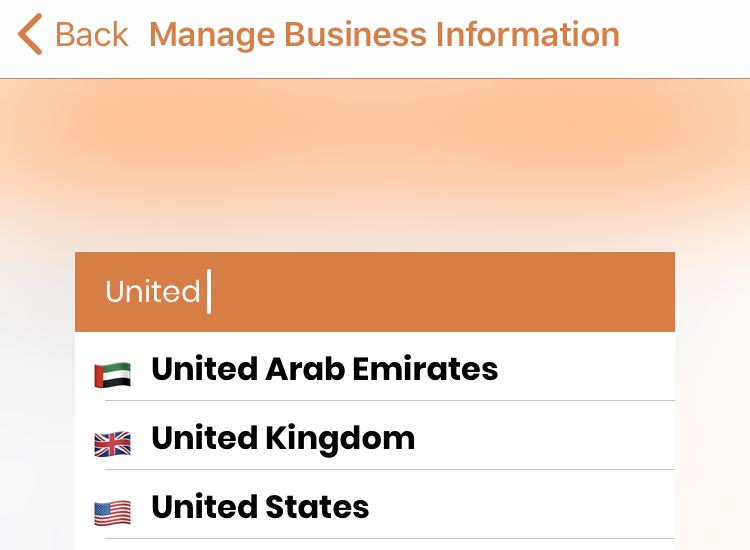

.. _bizinformation:

####################
Business Information
####################

Your business information is shown on your public repair status page.
(See: :ref:`repairstatuspage` for more details.)
You can find the link to your shop's page at the top of this screen.

To change your businesses name, address, or phone number, tap in the field,
update the information, and tap on 'Save Changes'.

To add a logo photo, tap on the image icon and take a picture of your logo.

To change the existing photo, tap on it, take a new logo photo, and then tap on
'Save Changes'.

-------
Country
-------

This is where you can set the Country that your shop is in.  It will be set to
your device's country when you create a Repairtagger account, and will default
to the US if no country is detected or otherwise set.

To set or change your shop's country, tap in the box labeled 'Country'. It looks
like this if you have not yet set a specific country:

When you tap in the box, the country selection will open.  Start typing the name
of the country you wish to set, and tap on it when it appears in the list.  It
will look like this:

Then save the Business Information page.  All new customers created will have
the default country code for phone numbers set to the shop country.  If a shop
country is not set, this will default to the US.  
