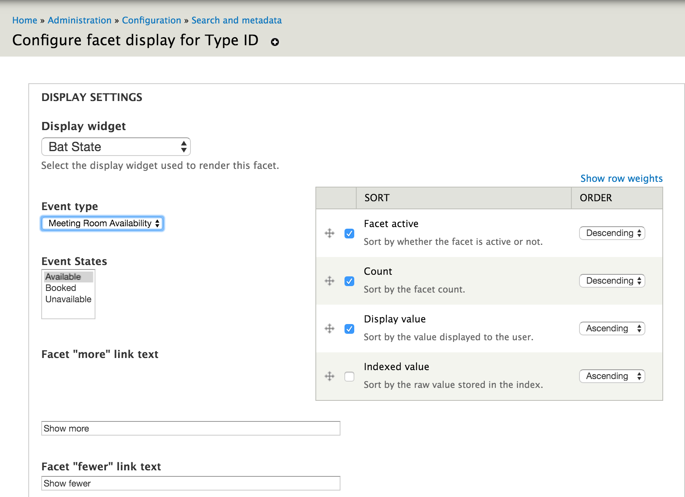
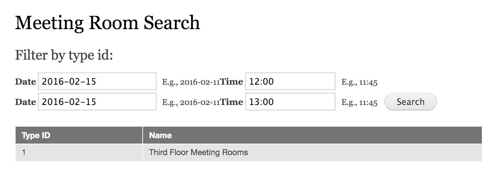
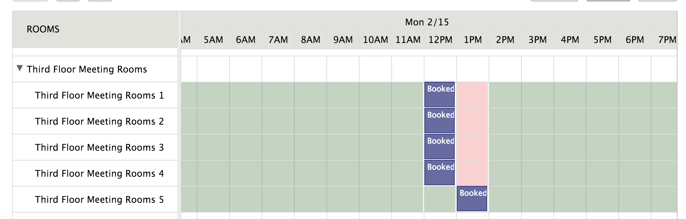
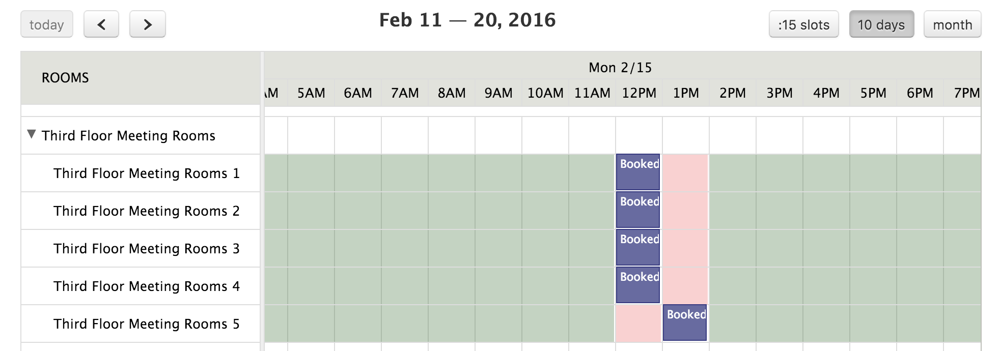

.. _bat_drupal_search_availability:

Searching for Availability
***************************
There are several way to search for availability, which ultimately, resolves in using the BAT PHP Library to determine in what state a unit is in over a given period of time. 

BAT for Drupal supports out-of-the-box availability searches, integrated with the Search API and the Facet API. This enables you to build a view of search results where availability search is another search facet.

Requirements
------------

#. Make sure the BAT Facets module is enabled. 
#. We are going to be using a Search View so the "Search Views" module (bundled with the Search API) needs to be enabled as well.
#. Finally, for the example, we are going to be using the MySQL Drupal database as a back-end so we will need the `Search API Database Search <https://www.drupal.org/project/search_api_db>`_ module.

Create an index of types
-------------------------
The BAT Facets module does a search on types of units and presents a type as available over a given date range if there is at least one unit of that type available.

Create a server for meeting rooms:

.. image:: images/meeting-room-server.png

Create an index of meeting rooms:

.. image:: images/meeting-room-index.png

Add a Facet on Type ID
----------------------
Add a facet of the type Type ID

.. image:: images/type-id-facet.png

Configure the facet to use the BAT State widget, selecting the event states to return on search. By choosing the **Available** state, you will get back types that are available (the typical use case), but you can just as easily search for other states.

Create a view to do search
---------------------------
Now we will create a view and add the facet block to that view. (This is not meant to be a tutorial on creating Views or using the Search API - there is a lot of documentation on that on the `Search API module page <https://www.drupal.org/project/search_api>`_)

With the view in place you are able to do a search:

The state of our meeting rooms is actually:

So we do get a result for 1200-1300 because there is one meeting room available. If we set that to unavailable:

Our search will not produce any results

.. image:: images/no-results.png

As this is all based on easily configurable behavior through the UI or code, you can adjust to get the theme/behavior that your application requires.