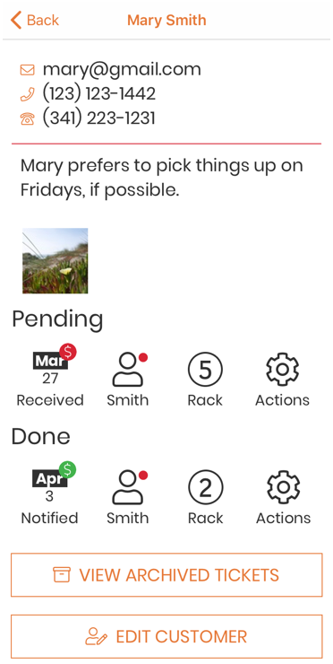

.. _customerstatus:

####################
Customer Status Page
####################

The customer status page will show you all of the information stored in
Repairtagger for a specific customer, and their open tickets.

Customer Information
--------------------

Phone Number(s)
+++++++++++++++

If the customer has a mobile phone number or landline, it will be shown here.
If you are using Repairtagger on a phone, tap on a phone number to place a call.

Email
+++++

If the customer has an email address, it will be shown here. Tapping on the
email will open a new email in the default email application on your device,
with the customer’s email address prefilled.

Open Tickets
------------

If a customer has open tickets, they will be shown here.

Pending Tickets
+++++++++++++++

Tickets that are waiting to be worked on are shown in the 'Pending' section.

Done Tickets
++++++++++++

Tickets for which the customer has been notified will be shown in the 'Done'
section.

Archived Tickets
----------------

To see archived tickets for this customer, simply click on the 'View archived
tickets' button at the bottom of the status page - you will be taken to the
ticket list, filtered to show only that customer's archived tickets

.. .. image:: images/customer_archived_tickets.png

Edit Customer
-------------

Tap on the 'Edit Customer' button to change the information stored for that
customer.  See: :doc:`editcustomer` for more details.
