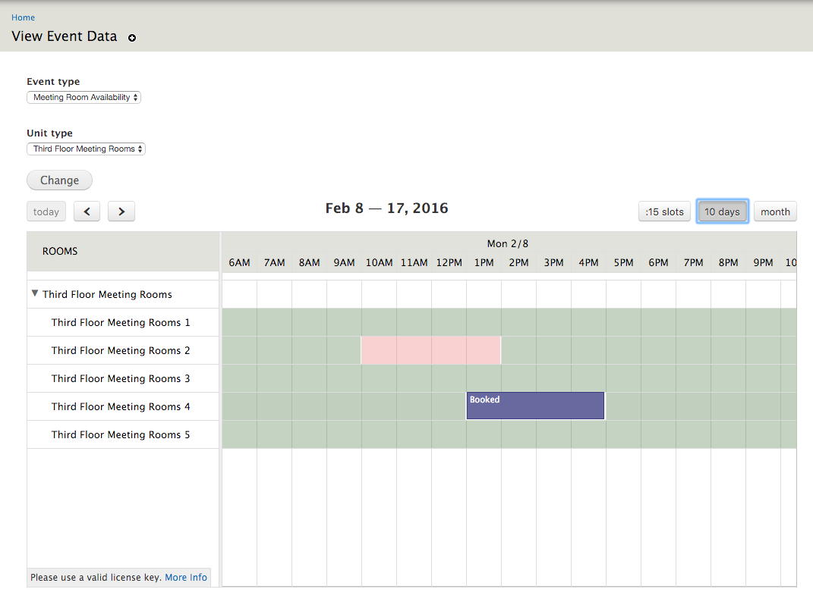

.. _bat_manage_units:

Manage Units
*************

Once you have:

#. Created Type Bundles - :doc:`type_bundles`
#. Create Event Types - :doc:`events`
#. Connected Events to Type Bundles - :doc:`events_types`
#. Created at least one Type - :doc:`types`

you can now go ahead and actually manage your units!

Visit `admin/bat/unit-management`.

.. image:: images/unitmanagement.png

Add or Remove Units
===================

To add the type of units you are interested in, click on "Units" and then "Add Units."

.. image:: images/add_units.png

BAT will automatically assign names, based on the unit type, which you can then go in and edit.

You can also delete units by selecting them and using the **Views Bulk Operation** action to delete them.

Manage Unit Events
==================

The links to manage events under the **Calendars** section will only appear if type bundles and event types are connected. Clicking on them will take you to a default **Event Unit Management** view which allows you to manage your events.

