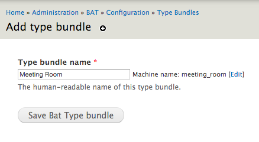

.. _bat_drupal_type_bundles:

Type Bundles
************

Introduction
============

Types are the categories of units that BAT manages (rooms, cars, tours, activities, etc.). In order to create a type you must first create a Type Bundle.

Think of Type Bundles just like Node Types. We use them to define the fields that the different types of things will have.

    *Why did you call them Type Bundles?*
      Good question! Type Bundles are essentially Type Types. Confused? Yeah - we thought so. Just like Drupal has Nodes and then Node Types, BAT has Types and then... Type Types. You see the problem? Type Bundles just gives us a way to talk about Types of Types without getting our tongues and our brains in a twist.

Types are the actual categories of units. For example, if we consider hotels, our Type Bundle would be Rooms and our Types would be the different styles of rooms. The diagram below shows some examples. It is important to get comfortable with the notion of Type Bundles, Types, and Units, as this is the basis of building a booking systems with BAT.

.. image:: images/types.png

Create a Type Bundle
====================

Visit ``admin/bat/config/type-bundles`` and click Add A Type Bundle.

We will add a Meeting Room Type Bundle.

With our Type Bundle in place, we can now add the fields that we require to describe our type. For example: capacity, equipment, notes, etc. Since this is an entity type, we have the entire Field API at our disposal.
