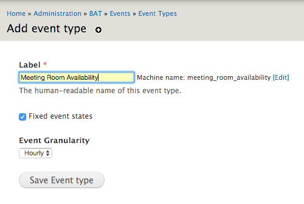
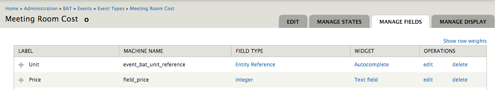
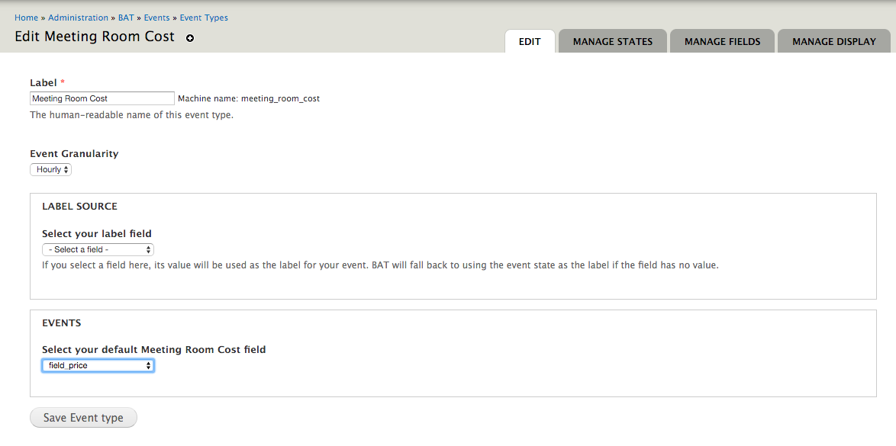

.. _bat_drupal_events:

Events
******

BAT Events are the events that our types of units can go through. Typically there will be two types of events, availability events and pricing events. BAT, however, makes no assumptions about this. Instead, it provides tools that enable you - the booking tool builder - to define the types of events that *happen* to your units.

.. tabs::

    .. group-tab:: 8.x

        Events and Event Types are managed at ``/admin/bat/events/event``.

        .. image:: images/events_d8.png

    .. group-tab:: 7.x

        Events and Event Types are managed at ``admin/bat/events``.

        .. image:: images/events.png

Create an Event Type
====================
As an example, we will create an Availability Event Type to manage the availability of meeting rooms.

We visit ``admin/bat/events/event-types/add`` and define an event called "Meeting Room Availability."

Event States
-------------
There are two possible types of event states: fixed or open.

Fixed Event States
^^^^^^^^^^^^^^^^^^
Fixed event states can only have a pre-defined set of values associated with them. This allows us to define states such as "Available" and "Booked" by associating numerical (integer) values to those labels.

Furthermore, fixed event states can be blocking or not. Blocking states means that they cannot simply be overriden on the calendar by dragging over them and assigning a new state. They need to be dealt with explicitly. A great example is a booking event. You need to explicitly delete a booking, you cannot simply drag over it and delete it. Instead, if you are simply making something available or unavaialble, you can just drag and select the dates and change the state of the event for those dates.

Open Event States
^^^^^^^^^^^^^^^^^
Open event states can have any integer value associated with them. This is great for managing pricing over time. A pricing event can have a value assigned to it that represents the price of booking a unit over that time period.

Event Granularity
------------------
Events can either be of hourly or daily granularity. This setting simply influences how BAT presents the interface to a user, since all events are saved down to the minute granularity in the database.

Define Event States
====================
Once the event type is created, we can add fields to it that will contain the event value over a time period.

Fixed Event States
-------------------

.. tabs::

    .. group-tab:: 8.x

        For fixed event states there is a two step process:

        *  Define fixed states. Visit ``/admin/bat/events/state`` and click Add State. You will need to select the Event Type you wish to associate this state with, simply start typing its name.

        .. image:: images/meeting-room-states-d8.png

        For each state, you can provide a label and pick a color that will be used on calendar views. Finally, you can also define the state as blocking or non-blocking.

        *  Add a field that points to possible state values. With the states defined, you actually still need a way for your event to hold the value of a state. To avoid hard-coding this as a property of the Event entity, add it via a field that BAT introduces, the *BAT Event State Reference* field. This field is added programmatically by BAT to fixed state event types so if you visit: ``admin/bat/events/event-types/manage/<your event type name>/fields`` you will find it listed.

        .. image:: images/fields-fixed-state-events.png

    .. group-tab:: 7.x

        For fixed event states there is a two step process:

        *  Define fixed state events. Visit ``admin/bat/events/event-types`` and click on **Manage States** for the event that you want to add states to.

        .. image:: images/meeting-room-states.png

        For each state, you can provide a label and pick a color that will be used on calendar views. Finally, you can also define the state as blocking or non-blocking.

        *  Add a field that points to possible state values. With the states defined, you actually still need a way for your event to hold the value of a state. To avoid hard-coding this as a property of the Event entity, add it via a field that BAT introduces, the *BAT Event State Reference* field. This field is added programmatically by BAT to fixed state event types so if you visit: ``admin/bat/events/event-types/manage/<your event type name>/fields`` you will find it listed.

        .. image:: images/fields-fixed-state-events.png

Arbitrary Event States
----------------------
For arbitrary event states, you simply add a field that will hold the event value and then indicate what field that is so BAT can use it. For example, for a pricing type event we would:

* Add an integer (or commerce price) field to hold the cost

* Then in ``admin/bat/events/event-types/manage/<my event type>`` we select that field as holding the event value.

