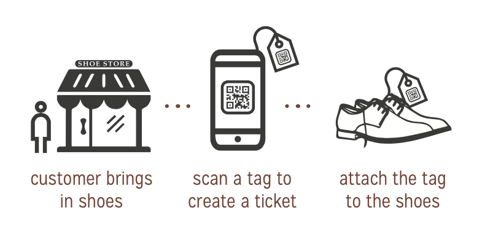
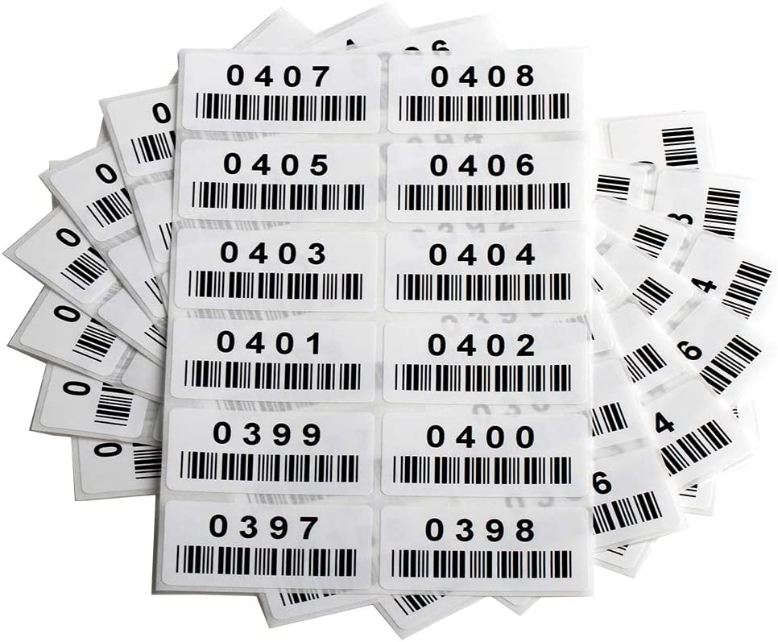

.. _tagoptions:

####################
Physical Tag Options
####################

Repairtagger requires the use of physical tags that will link the item to be
repaired to the ticket in the app using a tag number.

As an example, if you were a Shoe Repair shop and a customer brought in a pair
of shoes to be repaired, you would:

1. scan a tag to create a ticket

2. enter all the ticket information (such as customer, repairs the shoes need,
   etc.)

3. attach the tag you scanned to the pair of shoes

Now anytime you scan the tag attached to the pair of shoes, you can access all
of the information associated with that repair.

There are a number of options available for physical tags that can be used with
Repairtagger.  You can use paper tags, stickers, reusable tags with numbers,
reusable tags with barcodes, or you can even write a number on a piece of paper
in a pinch!

`Single Use tags - Paper`_

`Reusable tags - Numbered`_

`Reusable tags - QR Codes`_

`Reusable tags - Barcodes`_

`Coming Soon - Printed tags!`_

***********************
Single Use tags - Paper
***********************

If you already use numbered paper tags in your shop, you can continue to use
them with Repairtagger. The only restriction is that a tag number can only be
in use on one ticket at a time.

Some examples of paper tags that would work well with Repairtagger are:

`XPresstags <https://www.xpresstags.com/manila-repair-tags/tag-with-stub-and-strings/sku-t368-s>`_

`ULine <https://www.uline.com/Product/ProductDetailRootItem?modelnumber=S-7220>`_

You could even use numbered stickers like these!

`Find them at Amazon <https://www.amazon.com/Consecutively-Numbered-Labels-Measure-Sequences/dp/B00GLRVTI8?ref_=fsclp_pl_dp_1&th=1>`_

How to scan a numbered tag
--------------------------

IMAGE of scan icon in footer

1. Tap on the ‘scan’ icon in the footer
2. Tap on the ‘Tag’ icon tab at the top of the page
3. Position the lit box over the tag number.
4. Hold it there until a button appears beneath the camera window with the tag
   number on it.
5. Tap on the button. You will see a ‘Loading Tag’ message. If this tag number
   is in use on a ticket, you will be taken to the ticket.  If it is not in use,
   a new ticket will be created.

IMAGE of OCR scanning a paper tag

************************
Reusable tags - Numbered
************************

Any tags with clearly written numbers can be used with Repairtagger.

You can use brass tags like these

.. image:: images/brasstags.jpg
  :width: 200

`Find them on Amazon <https://www.amazon.com/Numbered-Brass-Tags-Number-Options/dp/B079X5DT1H>`_

Or acrylic tags

`Find them on Amazon <https://www.amazon.com/Hamimelon-Engraved-Numbered-Acrylic-Organizing/dp/B0773NLNWK/ref=sr_1_5?keywords=numbered+tags&qid=1585778169&sr=8-5>`_

************************
Reusable tags - QR Codes
************************

************************
Reusable tags - Barcodes
************************

Or barcoded stickers!

`Find them on Amazon <https://www.amazon.com/Pre-Printed-Consecutively-Numbered-Sticker-001-480/dp/B07SRSWRM1/ref=sr_1_5?keywords=QR+code+tags&qid=1585778459&sr=8-5>`_

***************************
Coming Soon - Printed tags!
***************************

Tap on the ‘Scan tag’ icon in the footer

Scan tag with number
Tap on the ‘#’ tab at the top of the page

Position the lit box over the tag number.
Once the code is successfully read, you will see a ‘Loading Tag’ message, and you will be taken to the existing ticket, if the tag number is in use, or to a new ticket, if the tag number is not in use.
Scan tag with QR Code
Tap on the ‘Camera’ tab at the top of the page

Line up the qr code on the tag in the camera frame.
Once the code is successfully read, you will see a ‘Loading Tag’ message, and you will be taken to the existing ticket, if the tag number is in use, or to a new ticket, if the tag number is not in use.
Type a tag number in manually
Tap on the ‘Keyboard’ tab at the top of the page

Type the tag number into the box.
Tap "Load"
You will see a ‘Loading Tag’ message, and you will be taken to the existing ticket, if the tag number is in use, or to a new ticket, if the tag number is not in use.
