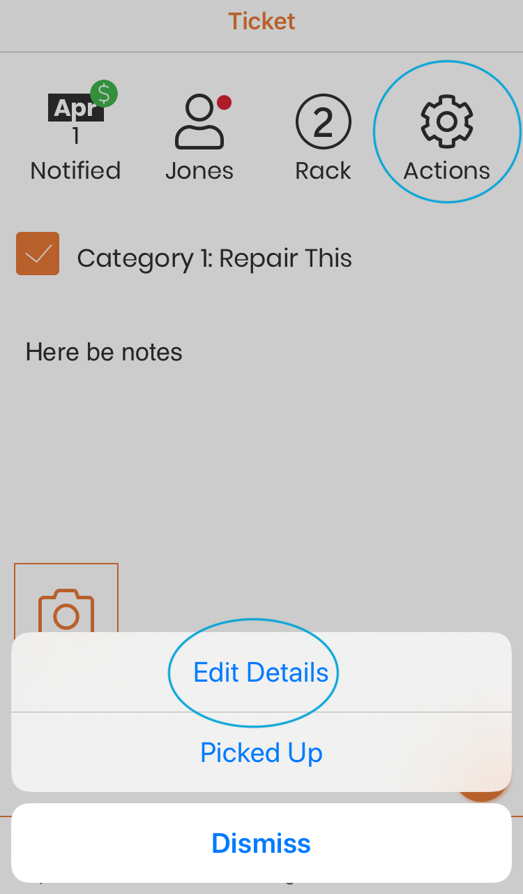
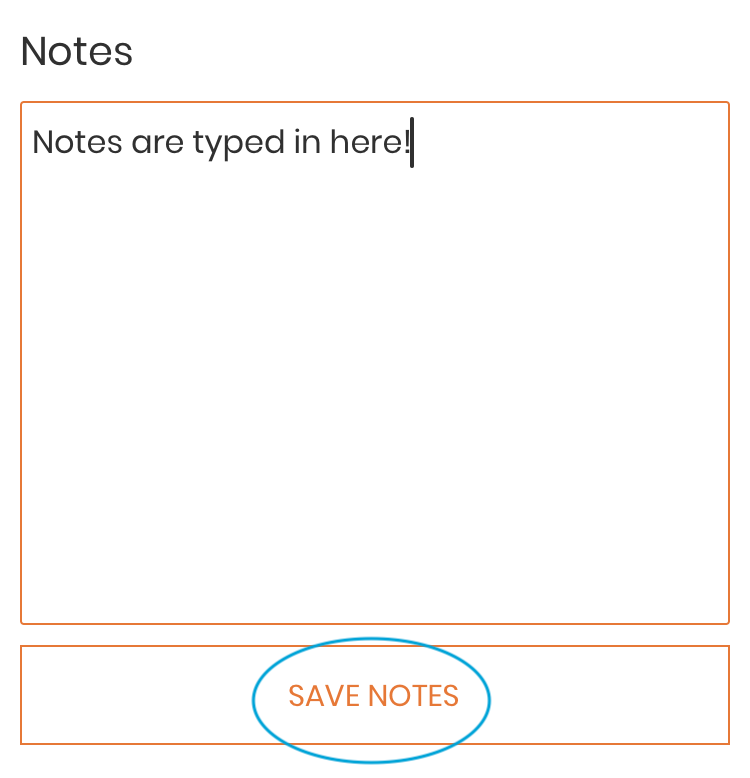

.. _dothework:

###################
Step 3: Do the Work
###################

To work on a ticket, start by scanning the tag.
:ref:`scantag`

When you scan the tag of an existing ticket, you will be taken to the View
ticket screen. (See: :ref:`viewticket` for more details.)

***********************
1. Complete repair work
***********************

Each repair type on the ticket will be shown with a checkbox when viewing the
ticket. When a repair is complete, tap on the checkbox, and it will be marked
as done. If you tap it by mistake, simply tap again, it will be unchecked.
When all repairs on the ticket are marked as complete, the notifications options
will appear. If you are now done with the ticket, move to :doc:`notifications`.

If you wish to add photos of the completed repair, or update the ticket notes,
tap on 'Not yet' in the notifications dropdown and continue with
`Adding Notes or Photos (Optional)`_

*********************************
Adding Notes or Photos (Optional)
*********************************

If you wish to update the ticket with notes or photos of the completed repair,
now is the time to do it!  You will not be able to edit the ticket once the
customer has picked up the item and the ticket has been archived. To add an
photo, simply tap on the Image icon.

Your device camera will open. Click the shutter button to take a picture. If
you are happy with the image, click on 'Use Photo', otherwise click on 'Retake'
to retake the picture. The 'add image' will be replaced with the thumbnail while
the image uploads.

To add notes, edit the ticket. Tap on the 'Gear' icon in the ticket status bar
and select 'Edit Ticket'.

Update the notes as wished, and tap on 'Save Notes'. (See: :ref:`editticket` for
more information about editing tickets.)

Scroll down until you see the 'View Ticket' button.  Tap on this. Now you are
ready to notify the customer. Tap on the 'Gear' icon, select 'Send
Notification', and continue with :doc:`notifications`.
