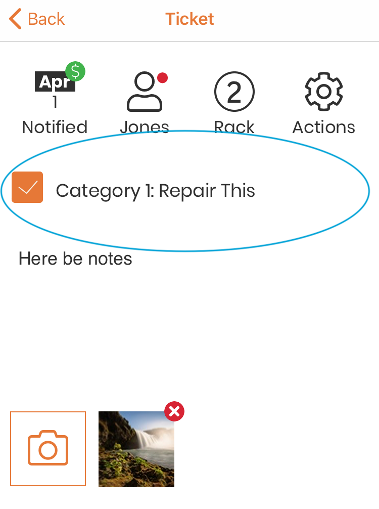
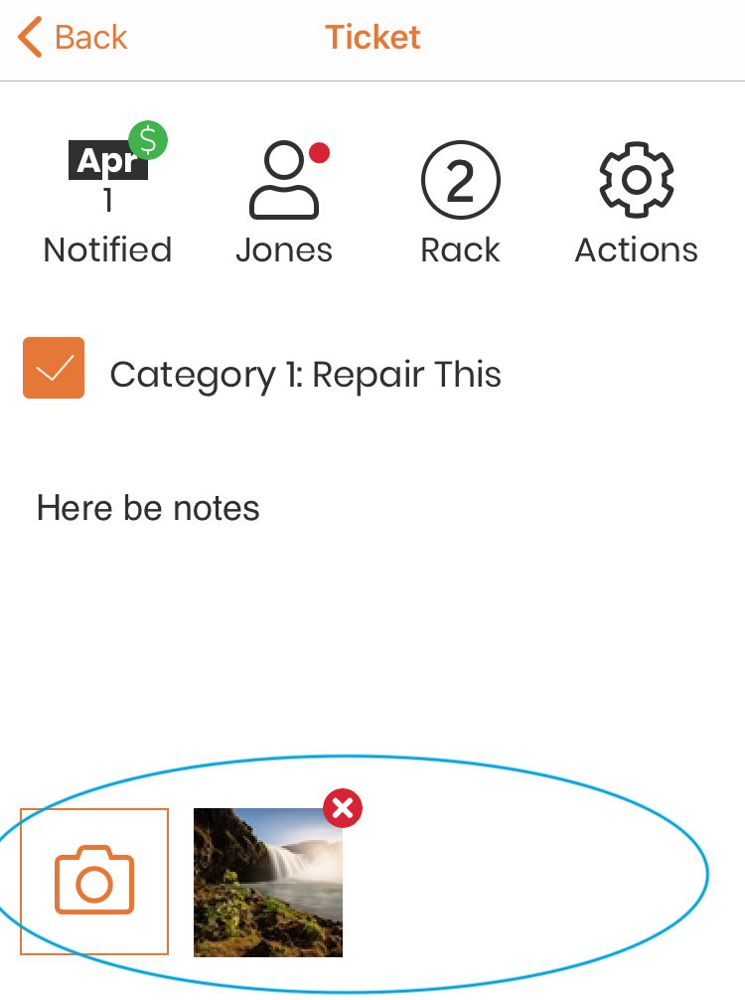

.. _viewticket:

###########
View Ticket
###########

To work on a ticket, start by scanning the tag. See: :ref:`scan` for
instructions.

When you scan a tag number with an existing ticket, you are taken to the View ticket
page for the ticket with that tag number.

.. note:: If a ticket was created without adding a customer and/or repairs, it
  is considered incomplete. When you scan the tag number for that ticket, you
  will be taken to the edit ticket page instead of the view ticket page, so that
  you can add a customer and repairs. See :ref:`editticket` for help.

The View ticket page has the following possible components:

`Ticket Status bar`_

`Ticket Repair(s)`_

`Ticket Notes`_

`Ticket Photos`_

.. include:: ../_static/components/statusbar.rst

****************
Ticket Repair(s)
****************

Each repair type on the ticket will be shown with a checkbox when viewing the
ticket. When a repair is complete, tap on the checkbox, and it will be marked as
done. If you tap it by mistake, simply tap again, it will be unchecked. When all
of the repairs on the ticket are marked as complete, the notifications options
will appear. See: :ref:`notifications` for more details.

************
Ticket Notes
************

If the ticket has notes on it, they will be shown here.

*************
Ticket Photos
*************

If the ticket has photos, they will be shown here. You can add more photos
without editing the ticket.  Just tap on the 'add image' icon.

Your device camera will open. Click the shutter button to take a picture. If
you are happy with the image, click on 'Use Photo', otherwise click on 'Retake'
to retake the picture. The 'add image' will be replaced with the thumbnail while
the image uploads.

As soon as the upload is complete, the 'add image' icon will be shown again, and
another image can be taken. Thumbnails will appear to the right of the icon.

.. note:: Photos will occasionally take a little while to upload to the server.
 Do not worry if you do not see the uploaded photo right away!
